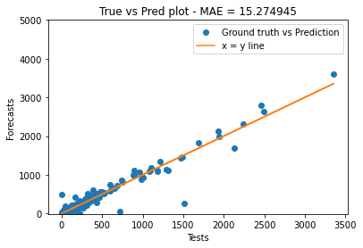

```python
# Import statements

import numpy as np
import pandas as pd
import warnings
from itertools import combinations

from statsmodels.tsa.arima.model import ARIMA
from statsmodels.tsa.ar_model import AutoReg
from statsmodels.tsa.vector_ar.var_model import VAR
from statsmodels.tsa.statespace.varmax import VARMAX
from statsmodels.tsa.statespace.structural import UnobservedComponents

from sklearn.metrics import mean_squared_error, mean_absolute_error
from scipy.stats.stats import pearsonr
from sklearn.tree import DecisionTreeRegressor
from sklearn.ensemble import RandomForestRegressor
from sklearn.model_selection import train_test_split

from google.cloud import bigquery
from google.oauth2 import service_account
from google.cloud.bigquery import magics
import pyarrow

import matplotlib.pyplot as plt
import seaborn as sns
```


```python
warnings.filterwarnings('ignore')
```


```python
# Assigning credentials for BigQuery project

BIGQUERY_PROJECT = 'ironhacks-covid19-data'
BIGQUERY_KEYPATH = '../service-account.json'

os.environ['GOOGLE_APPLICATION_CREDENTIALS'] = BIGQUERY_KEYPATH
bigquery_client = bigquery.Client(project=BIGQUERY_PROJECT)
```


```python
# Querying 'weekly_patterns' table for daily foot traffic

visits_query = """
SELECT poi_id, week_number, raw_visit_counts, visits_concentration, distance_from_home, median_dwell
FROM ironhacks_covid19_competition.weekly_patterns;
"""

query_job_visits = bigquery_client.query(visits_query)
```


```python
# Querying the week numbers in which an executive order was passed

exec_query = """
SELECT week_number
FROM ironhacks_covid19_competition.executive_orders
WHERE exec_order_exist = "Yes";
"""

query_job_orders = bigquery_client.query(exec_query)
```


```python
# Querying 'prediction_list_poi' table for prediction poi ids list

poi_lists_query = """
SELECT *
FROM ironhacks_covid19_competition.prediction_list_poi
"""

query_job_poi = bigquery_client.query(poi_lists_query)
```


```python
def arima(data, order=(1,1,1)):
    """
    Function to model the foot traffic time series data.
    It uses ARIMA model from 'statsmodels' package for forecasting.

    Parameters
        poi_id (str):  poi_id of the location for which we wish to model the foot traffic.

    Returns
        forecast (float):  Forecast value for the next time step in the series
    """

    model = ARIMA(data, order=order)
    try:
        fitted = model.fit(method='yule_walker')
    except:
        fitted = model.fit()

    forecast = fitted.forecast(steps=1)[0]

    return forecast
```


```python
# evaluate combinations of p, d and q values for an ARIMA model
def evaluate_models(data, pdqs):
    """
    Function to evaluate the ARIMA model with the given (p,d,q) combination

    Parameters
        data:  time series data
        pdqs:  all possible combinations of (p,d,q) tuple where the values are either 0 or 1.

    Returns
        best_order(tuple):  best (p,d,q) combination for this time series
        best_score(float):  absolute error for the said best_order ARIMA model
    """
    best_score, best_order = float("inf"), None
    for pdq in pdqs:
        mse = abs(ARIMA(data[:-1], order=pdq).fit().forecast()[0] - data[-1])
        if mse < best_score:
            best_score, best_order = mse, pdq

    return best_order, best_score

def arima_best(data, pdqs):
    """
    Function to find the best (p,d,q) combination for ARIMA model.
    It uses ARIMA model from 'statsmodels' package for forecasting.

    Parameters
        data:  time series data
        pdqs:  all possible combinations of (p,d,q) tuple where the values are either 0 or 1.

    Returns
        best_order(tuple):  best (p,d,q) combination for this time series
        best_score(float):  absolute error for the said best_order ARIMA model
        forecast (float):  forecast value for the next time step in the series
    """

    for pdq in pdqs:
        model = ARIMA(data, order=pdq)
        fitted = model.fit()

    forecast = fitted.forecast(steps=1)[0]

    return best_order, best_score, forecast
```


```python
def structural_model(data):

    model = UnobservedComponents(data, autoregressive=1)
    fitted = model.fit()

    forecast = fitted.forecast()[0]

    return forecast
```


```python
def forest_regressor(df, mode='train'):
    """
    Function to model the foot traffic time series data (validation process).
    It uses Random Forest Regressor model from 'sklearn' package for forecasting.

    Parameters
        df (pandas.DataFrame):  dataframe containing features and targets for a particular POI
        mode (string): if mode = 'train', then the forecast is done for the last week in dataset and compared to ground truth. else it is treated as test
                       forecast is done for week 44.

    Returns
        forecasts (float):  Forecast value for the next time step in the series
        y (int): True value to be compared with the forecasted value
    """

    if mode == 'train':
        n = 2
    else:
        n = 1

    X = df.drop(['poi_id', 'raw_visit_counts'], axis=1)
    y = df['raw_visit_counts'].shift(periods=-1)

    dtregr = RandomForestRegressor(n_estimators=25)
    dtregr.fit(X[:-n], y[:-n])

    forecast = dtregr.predict(np.array(X.iloc[-n]).reshape(1,-1))

    return forecast
```


```python
def fourierExtrapolation(x, n_predict):
    """
    Function to extrapolate 'n_predict' number of steps for a time series using Fourier Transform.
    Code taken from: https://gist.github.com/tartakynov/83f3cd8f44208a1856ce

    Parameters:
        x (array): array with time series value for which forecasting should be performed
        n_predict (int): number of terms to forecast from the last value in x

    Returns:
        array: array with forecasted values
    """
    n = x.size
    n_harm = 4                     # number of harmonics in model
    t = np.arange(0, n)
    p = np.polyfit(t, x, 1)         # find linear trend in x
    x_notrend = x - p[0] * t        # detrended x
    x_freqdom = np.fft.fft(x_notrend)  # detrended x in frequency domain
    f = np.fft.fftfreq(n)              # frequencies
    indexes = list(range(n))
    # sort indexes by frequency, lower -> higher
    indexes.sort(key = lambda i: np.absolute(f[i]))

    t = np.arange(0, n + n_predict)
    restored_sig = np.zeros(t.size)
    for i in indexes[:1 + n_harm * 2]:
        ampli = np.absolute(x_freqdom[i]) / n   # amplitude
        phase = np.angle(x_freqdom[i])          # phase
        restored_sig += ampli * np.cos(2 * np.pi * f[i] * t + phase)

    return restored_sig + p[0] * t
```


```python
# Writing query results to dataframe

poi_list = query_job_poi.to_dataframe()
weekly_patterns = query_job_visits.to_dataframe()
order_weeks = [row[0] for row in query_job_orders.result()]
```


```python
locations = weekly_patterns['poi_id'].unique() # Retrieving locations list from dataframe
```


```python
"""
Of all my previous submissions, the submission with ARIMA model scored the best. Hence, in this submission, I'm trying a grid search optimization to find
the best (p,d,q) combination for the model. Each of the 1804 locations will be model independently and different (p,d,q) tuples will be found. Since the
time series is small for one particular location, I restricted the values of the tuple to be in the range of [0, 1]. Higher order values will result in complex
and computationally intensive models, which might overfit the data.
"""

forecasts = []
tests = []

for idx, location in enumerate(locations):
    df = weekly_patterns[weekly_patterns['poi_id'] == location].sort_values(by='week_number')
    try:
        forecast = arima(df['raw_visit_counts'].values[:-1], order=(1,0,1))
        forecasts.append(forecast)
        tests.append(df['raw_visit_counts'].values[-1])

        if idx % 200 == 0:
            print("{} locations done.".format(idx))

    except Exception as e:
#         print(e)
#         break
        forecast = arima(df['raw_visit_counts'].values[:-1], order=(1,0,0))
        forecasts.append(forecast)
        tests.append(df['raw_visit_counts'].values[-1])
```

    0 locations done.
    200 locations done.
    400 locations done.
    600 locations done.
    800 locations done.
    1000 locations done.
    1200 locations done.
    1400 locations done.
    1600 locations done.
    1800 locations done.


```python
forecasts = [int(forecast) if forecast >= 0 else 0 for forecast in forecasts]
mean_squared_error(tests, forecasts), mean_absolute_error(tests, forecasts)
```


    (2111.9977827051, 15.274944567627495)


```python
forecasts = [int(forecast) if forecast >= 0 else 0 for forecast in forecasts]

plt.plot(tests, forecasts, 'o', label="Ground truth vs Prediction")
plt.plot(tests, tests, label="x = y line")
plt.ylim(-10, 5000)

plt.xlabel("Tests")
plt.ylabel("Forecasts")
plt.title("True vs Pred plot - MAE = {:2f}".format(mean_absolute_error(forecasts, tests)))
plt.legend()

plt.show()
```





```python
"""
MAKING PREDICTIONS FOR SUBMISSIONS
----------------------------------
"""

loc_errors = []  # list to capture erring location ids
forecasts = [] # list to capture forecasted values

print("Modelling started")
print("---------------")

for idx, location in enumerate(locations):
    df = weekly_patterns[weekly_patterns['poi_id'] == location].sort_values(by='week_number')
    try:
        f = arima(df['raw_visit_counts'].values, order=(1,0,1))
        forecasts.append(f)

        if idx % 300 == 1:
            print("Finished modelling {}/1804 location(s)".format(idx))

    except Exception as e:
        loc_errors.append(location)
        print("Location ID: {} - Incomplete".format(location))

print("---------------")
print("Modelled 1804/1804 locations")
```

    Modelling started
    ---------------
    Finished modelling 1/1804 location(s)
    Finished modelling 301/1804 location(s)
    Finished modelling 601/1804 location(s)
    Finished modelling 901/1804 location(s)
    Finished modelling 1201/1804 location(s)
    Finished modelling 1501/1804 location(s)
    Finished modelling 1801/1804 location(s)
    ---------------
    Modelled 1804/1804 locations


```python
# Neutralizing negative forecast values and discretizing all values
forecasts = [int(round(f)) if f >= 0 else 0 for f in forecasts]

# Creating a new dataframe with poi_id and forecasted values
df = pd.DataFrame({'poi_id': locations, 'raw_visit_counts': forecasts})

# Merging new dataframe with poi_id dataframe
submission_df = poi_list.merge(df, how='inner', on='poi_id')

# Writing the dataframe as csv file
submission_df.to_csv('submission_prediction_output.csv', index=False)
```
